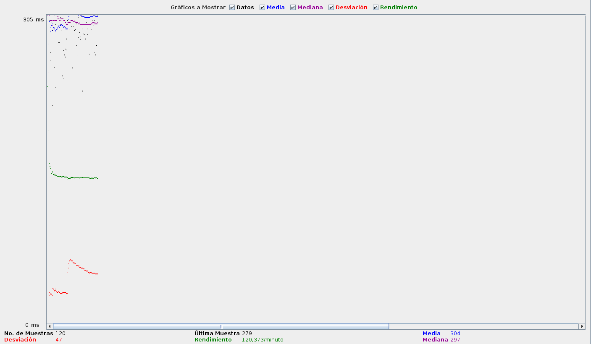

# GeoWebCache

## Pruebas de rendimiento con GWC
Para realizar las pruebas de optimización con GWC, lo primero que haremos será abordar ligeramente los conceptos de GWC. La idea de GWC es la de generar una especie de pirámide de teselas almacenada en disco. Para ello utiliza el concepto de GridSet. GWC alamcenará teselas obtenidas de un WMS. Estas teselas serán agnósticas al sistema de referencia, por lo que nos tendremos que apoyar en el concpeto de GridSet, un grid resctangular indexado por coordenadas **x** e **y** y con **z** para determinar el concepto de zoom.


Para empezar a configurar GWC, lo primero que haremos será definir la variable *GEOWEBCACHE_CACHE_DIR* en nuestro archivo *setevn.sh*.

```bash
export GEOWEBCACHE_CACHE_DIR="/var/local/geowebcache"
```

Reiniciamos *Tomcat* y ya tendremos configurada nuestra carpeta de GWC.

Ahora pasaremos a configurar una capa para que esa sea cacheada por GWC. Seguiremos trabajando con la capa vectorial utilizada en la sección anterior.

Para cachear la capa, iremos a la sección *Tile Caching* de GeoServer, *Tile Layers* y *Add a new cached layer*. Seleccionamos la capa que deseamos cachear *unredd:toulouse_postgis* y pasamos a configurarla en la pestaña de *Tile Caching*.

Explicaremos a continuación algunos de los parámetros necesarios para la creación de la capa cacheada:

* BlobStore: nos permite definir donde GWC guardará los datos.
* Metatiles: [documentación sobre metatileado](http://snmb-admin.readthedocs.io/en/latest/metatileado.html)
* Tile Image Formats, formato de las imágenes, PNG8 para imágenes con mas de 256 colores. Ocupan más.
* GridSet, necesario para crear las tiles en el sistema de referencia.


[Pregeneracion de Teselas](https://geotalleres.readthedocs.io/es/latest/geowebcache/pregeneracion.html)

### Pruebas

Partiremos probando la capa atacando directamente al WMS. Obtendremos la URL que defina una tesela de GWC para poder hacer la prueba.

* *Nombre o Servidor o IP*: url del servidor, en nuestro caso **192.168.0.12**
* *Puerto*: 8080
* *Ruta*: /geoserver/wms?LAYERS=unredd%3AMadridOrto4326&FORMAT=image%2Fpng&SERVICE=WMS&VERSION=1.1.1&REQUEST=GetMap&STYLES=&SRS=EPSG%3A4326&BBOX=-3.5595703125,40.4736328125,-3.548583984375,40.484619140625&**WIDTH=256&HEIGHT=256**



Ahora procederemos a crear la cache de la imagen como se comentaba anteriormente. Para consumir la imagen cacheada, habrá que decirle a nuestro cliente que ataque un endpoint diferente. GeoServer tiene integración directa de WMS con GWC. Si las peticones cumplen una serie de requisitos, podremos realizar las peticiones WMS con caché añadiendo el parámetro *tiled=true* en nuestra petición. También podremos atacar el servicio GWC directamente a través de una URL, sustituyendo `geoserver/<workspace>/wms` por `geoserver/gwc/servvice/wms` De esta manera quedaría:

* *Nombre o Servidor o IP*: url del servidor, en nuestro caso **192.168.0.12**
* *Puerto*: 8080
* *Ruta*: /geoserver/gwc/service/wms?LAYERS=unredd%3AMadridOrto4326&FORMAT=image%2Fpng&SERVICE=WMS&VERSION=1.1.1&REQUEST=GetMap&STYLES=&SRS=EPSG%3A4326&BBOX=-3.5595703125,40.4736328125,-3.548583984375,40.484619140625&WIDTH=256&HEIGHT=256

Antes de lanzar las peticiones, comprobaremos que el directorio de cacheado de la imagen se encuentra vacio.

La respuesta que tendremos será:


pero podremos comprobar que se han creado imágenes dentro de la carpeta de GWC:


y que en la pestaña de *Disk Quota* se han creado 424,0 Kb.