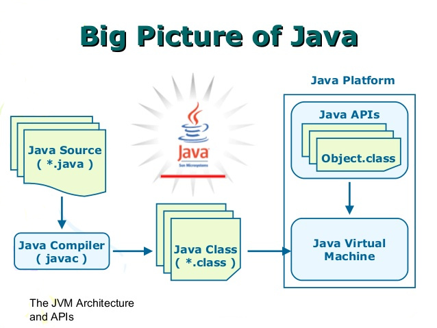
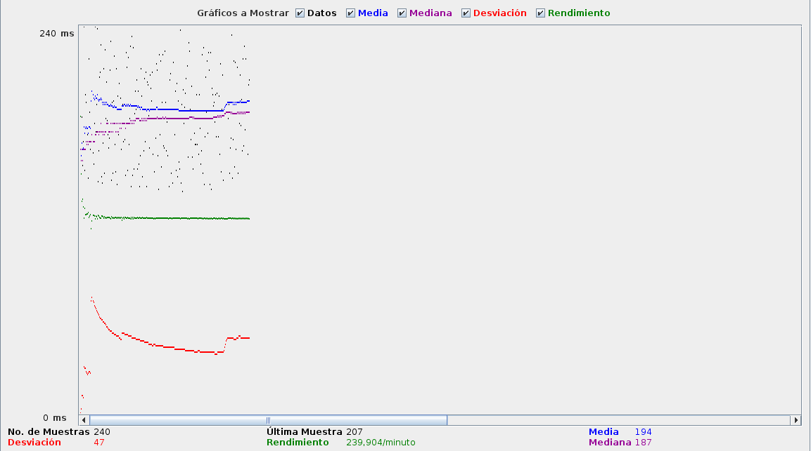
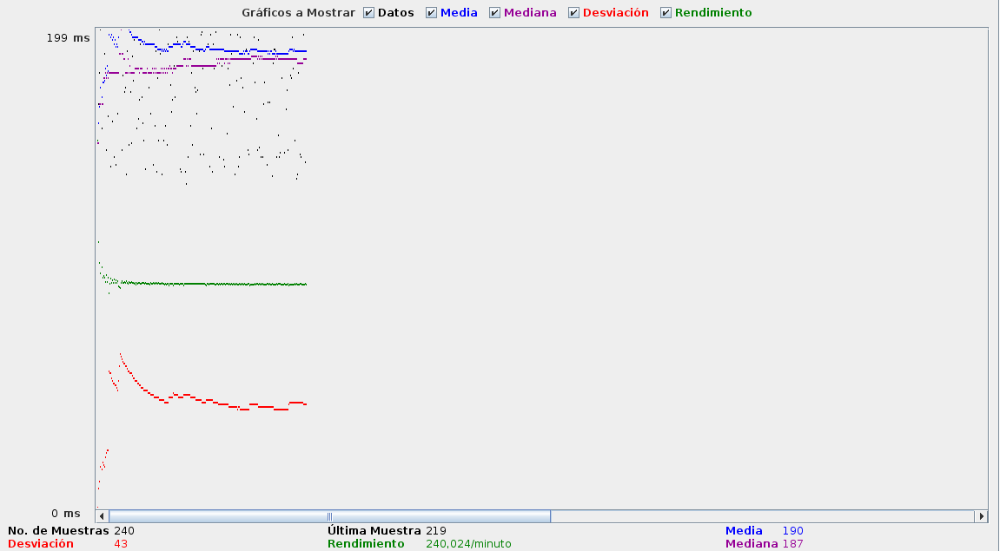
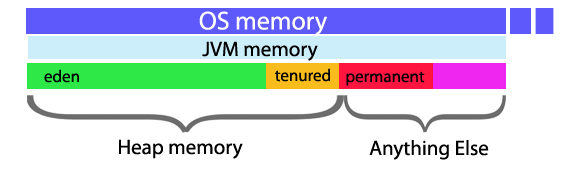
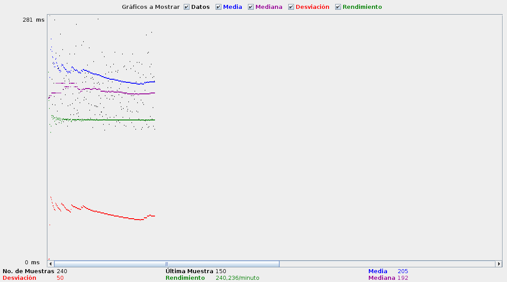
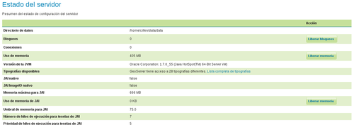
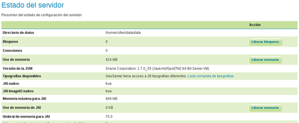

# Configurando Tomcat para que vuele
## Trabajar con la úlima versión oficial de Java

Una máquina virtual Java (en inglés Java Virtual Machine, JVM) es una máquina virtual de proceso nativo, es decir, ejecutable en una plataforma específica, capaz de interpretar y ejecutar instrucciones expresadas en un código binario especial (el bytecode Java), el cual es generado por el compilador del lenguaje Java. (Fuente. [Wikipedia](https://es.wikipedia.org/wiki/M%C3%A1quina_virtual_Java))



Antes de empezar a usar GeoServer, deberemos modificar ciertos parámetros en la JVM parfa poder obtener un rendimiento mínimo. Así una de las primeras necesidades que tenemos que cubrir, es la instalación del JDK de Oracle.

Para comprobar la si tenemos Java instalado en el servidor y que versión exacta del mismo, deberemos ejecutar:

```bash
$ java -version
```

lo que nos mostrará (en el caso de la máquina virtual del curso):


```bash
openjdk version "1.8.0_91"
OpenJDK Runtime Environment (build 1.8.0_91-8u91-b14-3ubuntu1~16.04.1-b14)
OpenJDK 64-Bit Server VM (build 25.91-b14, mixed mode)
```

En este caso vemos que tenemos Java instalado, pero la versión *OpenJDK*. Según la documentación oficial de Boundless acerca de GeoServer, recomienda trabajar con la versión de Oracle del JDK de Java. Haremos una prueba para comprobar el rendimiento. Desde JMeter, haremos peticiones a una capa de GeoServer con esta configuración.

* *Nombre o Servidor o IP*: url del servidor, en nuestro caso **192.168.0.12**
* *Puerto*: 8080
* *Ruta*: */geoserver/unredd/wms?service=WMS&version=1.1.0&request=GetMap&layers=unredd:TC_NG_Baghdad_IQ_Geo&styles=&bbox=44.0963439710014,33.01614124386756,44.696237571001404,33.61617364386756&width=767&height=768&srs=EPSG:4326&format=image/png8*



Ahora instalaremos la versión de Java que proporciona Oracle. En Ubuntu, el SO de la máquina virtual, [se realizará](https://www.digitalocean.com/community/tutorials/how-to-install-java-with-apt-get-on-ubuntu-16-04):

```bash
$ sudo add-apt-repository ppa:webupd8team/java
$ sudo apt-get update
```

y para instalar la versión 8 de Java:

```bash
$ sudo apt-get install oracle-java8-installer
```

si ahora volvemos a ejecutar:

```bash
$ java -version
```

obtendremos:

```bash
java version "1.8.0_101"
Java(TM) SE Runtime Environment (build 1.8.0_101-b13)
Java HotSpot(TM) 64-Bit Server VM (build 25.101-b13, mixed mode)
```

Si realizamos ahora con JMeter la misma prueba, obtendremos:



y podremos comprobar que para el conjunto de datos que hemos propuesto la diferencia entre ambas máquinas es prácticamente inexistente.

## Parámetros de la JVM



Procederemos ahora a configurar los parámetros de la JVM. Los parámetros sobre los que trabajaremos serán:

* -Djava.awt.headless=true
* -Xms256m
* -Xmx768m
* -XX:MaxPermSize=256m
* -DGEOEXPLORER_DATA

### -Djava.awt.headless=true
Esta opción valor *true* le indica a Java que trabajaremos sin interfaz gráfica.

### -Xms256m -Xmx768m
Con estos parámetros definiremos el tamaño del *heap* o memoria que Java. Los objetos de Java residen en una zona llamada *heap*. El *heap* se crea cuando la JVM se inicia y puede aumentar o disminuir de tamaño mientras se ejecuta la aplicación. Cuando la pila se llena, se recoge la basura, se inicia el proceso del *Garbage Collector*. Durante la recogida de basura, los objetos que ya no se utilizan se borran, con lo que se crea espacio para los nuevos objetos.

Algunas recomendación será que en producción es interesante que Xmx (Máximo tamaño del heap) y Xms (Mínimo tamaño del heap) sean idénticos.

### -XX:MaxPermSize=256m
La JVM tiene un espacio permanente para alojar objetos, el *Permanent Generation*. Será el espacio dinde se alojan las clases y los métodos.

> Se ha deprecado esta opción en Java 8 cambiándola por el *Metaspace* del que podremos definir el > tamaño máximo que podrá ocupar de la memoria del servidor.

## Aplicar parámetros a la JVM
Antes de aplicar los parámetros, realizaremos la misma prueba anterior con JMeter para comprobar el rendimiento sin estos. Para ver las opciones con las que está trabajando *tomcat* podremos ejecutar:

```bash
$ ps -ef | grep tomcat7

tomcat7   1844     1 42 09:52 ?        00:00:41 /usr/lib/jvm/default-java/bin/java -Djava.util.logging.config.file=/var/lib/tomcat7/conf/logging.properties -Djava.util.logging.manager=org.apache.juli.ClassLoaderLogManager -Djava.awt.headless=true -Xmx128m -XX:+UseConcMarkSweepGC -Djava.endorsed.dirs=/usr/share/tomcat7/endorsed -classpath /usr/share/tomcat7/bin/bootstrap.jar:/usr/share/tomcat7/bin/tomcat-juli.jar -Dcatalina.base=/var/lib/tomcat7 -Dcatalina.home=/usr/share/tomcat7 -Djava.io.tmpdir=/tmp/tomcat7-tomcat7-tmp org.apache.catalina.startup.Bootstrap start
```

Donde podremos observar que tiene una memoria máxima por defecto de **-Xmx128m**.

* *Nombre o Servidor o IP*: url del servidor, en nuestro caso **192.168.0.12**
* *Puerto*: 8080
* *Ruta*: */geoserver/unredd/wms?service=WMS&version=1.1.0&request=GetMap&layers=unredd:TC_NG_Baghdad_IQ_Geo&styles=&bbox=44.0963439710014,33.01614124386756,44.696237571001404,33.61617364386756&width=767&height=768&srs=EPSG:4326&format=image/png8*

```bash
Caused by: org.geoserver.platform.ServiceException: java.lang.OutOfMemoryError: Java heap space
        at org.geoserver.wms.map.RenderedImageMapOutputFormat.directRasterRender(RenderedImageMap$
        at org.geoserver.wms.map.RenderedImageMapOutputFormat.produceMap(RenderedImageMapOutputFo$
        ... 120 more
Caused by: java.lang.OutOfMemoryError: Java heap space
```

Esto significa que hemos saturado la memoria de Tomcat. 

Para aplicar los parámetros anteriores, podremos utilizar varios métodos. Uno de ellos será definir un archivo *setenv.sh* en la carpeta *$TOMCAT_HOME/bin* con la siguiente estructura:

```bash
#!/bin/bash

export GEOSERVER_DATA_DIR="/var/local/geoserver"
export JAVA_OPTS="-Djava.awt.headless=true -Xms1024m -Xmx1024m"
```
reiniciamos Tomcat:

```bash
$ sudo service tomcat7 restart
```

comprobamos que se han aplicado los nuevos valores:

```bash
$ ps -ef | grep tomcat7

tomcat7   2364     1 82 10:11 ?        00:00:35 /usr/lib/jvm/default-java/bin/java -Djava.util.logging.config.file=/var/lib/tomcat7/conf/logging.properties -Djava.util.logging.manager=org.apache.juli.ClassLoaderLogManager -Xms512m -Xmx1024m -XX:MaxPermSize=256m -Djava.endorsed.dirs=/usr/share/tomcat7/endorsed -classpath /usr/share/tomcat7/bin/bootstrap.jar:/usr/share/tomcat7/bin/tomcat-juli.jar -Dcatalina.base=/var/lib/tomcat7 -Dcatalina.home=/usr/share/tomcat7 -Djava.io.tmpdir=/tmp/tomcat7-tomcat7-tmp org.apache.catalina.startup.Bootstrap start
```

donde comprobaremos que se han aplicado los parámetros **-Xms512m -Xmx1024m**

Volvemos a realizar la prueba con JMeter:



## JAI y Java ImageIO
Java Advanced Imaging (JAI) es una biblioteca de manipulación de imágenes desarrollada por Sun Microsystems y distribuido con una licencia de código abierto. JAI Image I/O Tools proporciona plugins del lector, escritor, y flujo para el framework estándar de Java Image I/O. Varios parámetros JAI, utilizados por ambas operaciones WMS y WCS, se pueden configurar en la página Configuración de JAI.

Para instalar JAI y Java Image I/O seguiremops los siguientes pasos. Antes de instalar las librerías veremos:



Situarse en el directorio donde tengamos instalado el JDK de Java:

```bash
$ cd /usr/lib/jvm/<directorio del JDK>
```

Descargar la librería JAI:

```bash
$ wget http://download.java.net/media/jai/builds/release/1_1_3/jai-1_1_3-lib-linux-amd64-jdk.bin
```

Dar permisos de ejecución al archivo descargado:

```bash
$ chmod u+x jai-1_1_3-lib-linux-amd64-jdk.bin
```

Ejecutar:
```bash
$ ./jai-1_1_3-lib-linux-amd64-jdk.bin
```

Aceptar los términos de licencia y tendremos las JAI instaladas.

Ahora vamos con las ImageIO
Descargamos en el mismo directorio de las JDK:
```bash
$ wget http://download.java.net/media/jai-imageio/builds/release/1.1/jai_imageio-1_1-lib-linux-amd64-jdk.bin
```
Dar permisos de ejecución:
```bash
$ chmod u+x jai_imageio-1_1-lib-linux-amd64-jdk.bin
```
Ejecutamos:
```bash
$ ./jai_imageio-1_1-lib-linux-amd64-jdk.bin
```
Aceptamos términos de licencia y ¡¡tachán!!:
```bash
Unpacking…
tail: cannot open `+215’ for reading: No such file or directory
Checksumming…
1
The download file appears to be corrupted. Please refer
to the Troubleshooting section of the Installation
Instructions on the download page for more information.
Please do not attempt to install this archive file.
```

Para solucionar esto:
```bash
$ export _POSIX2_VERSION=199209
```
([Fuente: JGrass Tech Tips](http://jgrasstechtips.blogspot.com.es/2009/07/jai-tail-cannot-open-215-for-reading-no.html))


y volvemos a ejecutar:
```bash
$ ./jai_imageio-1_1-lib-linux-amd64-jdk.bin
```

Ahora debería aparecernos como instalada.




