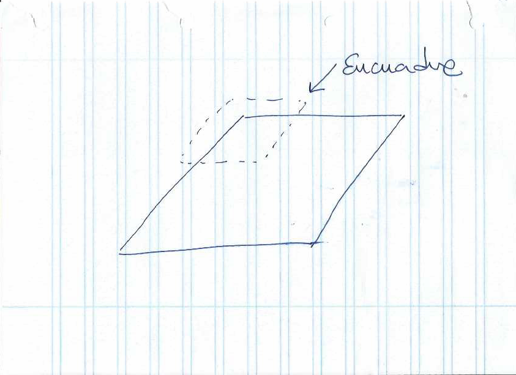
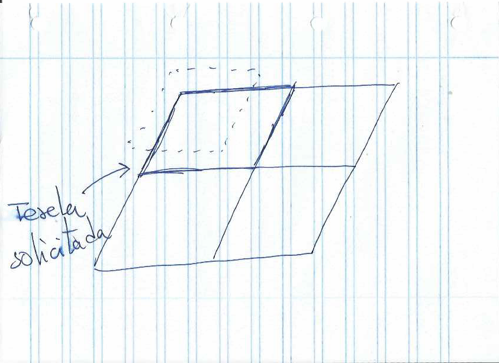

# Preparando datos Raster
Son varios los problemas que nos encontramos a la hora de optimizar los datos raster. Por un lado debemos encontrar un equilibrio que nos permita obtener una buena experiencia de navegación entre diferentes resoluciones y zooms.

Deberemos evitar en la medida de lo posible abrir un gran número de archivos en cada petición, o sea, disponer de nuestros datos en el número menor de archivos.

Para poder obtener la mejor configuración posible deberemos manejar diferentes formatos, compresiones, tamaños de tesela, etc.

## GeoTIFF
GeoTIFF es un standard que permite georeferenciar la información de un archivo TIFF.

GeoTIFF es un formato muy flexible, y es válido para muchos tipos de casos de almacenamiento de datos. Nos permite cantidad de configuraciones diferentes sobre el formato para adaptarlo a las necesidades puntuales de nuestros datos.

Para trabajar con GeoTIFF será necesario el conocimiento de [GDAL](http://www.gdal.org/), Geospatial Data Abstraction Library, una librería que nos permite el manejo de datos tanto raster (GDAL) como vector (OGR). La mayoría de los software GIS actuales se apoyan en esta librería para realizar operaciones sobre los datos.

Se podrá instalar GDAL para diferentes sistemas operativos. Instrucciones en su [web](https://trac.osgeo.org/gdal/wiki/DownloadingGdalBinaries).

### Georeferenciando al SRS más usado

> Para las pruebas siguiente se han definido:
> * Número de hilos: 240
> * Periodo de subida (en segundos): 60


Nuestros datos estarán en el sistema de referencia de datos en el que hayan sido creados. Por lo general, a la hora de publicarlos, deberemos valorar el sistema de coordenadas en el que vayan a ser más consumidos habitualmente, ya será en el propio de nuestra región, o en uno general como [EPSG:4326](https://epsg.io/4326) o uno específico de web [EPSG:3857](https://epsg.io/3857). GeoServer nos permite la reproyección de los datos al vuelo, pero esto require un consumo de CPU y memoria que penalizará la visualización de los datos en función de la disponibilidad de estos recursos en nuestros servidores.

Lo primero será comprobar el sistema de referencia de nuestros datos, para ello:

```bash
$ gdalinfo /var/local/geoserver/data/TC_NG_Baghdad_IQ_Geo.tif

Driver: GTiff/GeoTIFF
Files: TC_NG_Baghdad_IQ_Geo.tif
       TC_NG_Baghdad_IQ_Geo.tfw
Size is 4322, 4323
Coordinate System is:
GEOGCS["WGS 84",
    DATUM["WGS_1984",
        SPHEROID["WGS 84",6378137,298.257223563,
            AUTHORITY["EPSG","7030"]],
        AUTHORITY["EPSG","6326"]],
    PRIMEM["Greenwich",0],
    UNIT["degree",0.0174532925199433],
    AUTHORITY["EPSG","4326"]]
Origin = (44.096343971001403,33.616173643867562)
Pixel Size = (0.000138800000000,-0.000138800000000)
Metadata:
  AREA_OR_POINT=Area
Image Structure Metadata:
  INTERLEAVE=PIXEL
Corner Coordinates:
Upper Left  (  44.0963440,  33.6161736) ( 44d 5'46.84"E, 33d36'58.23"N)
Lower Left  (  44.0963440,  33.0161412) ( 44d 5'46.84"E, 33d 0'58.11"N)
Upper Right (  44.6962376,  33.6161736) ( 44d41'46.46"E, 33d36'58.23"N)
Lower Right (  44.6962376,  33.0161412) ( 44d41'46.46"E, 33d 0'58.11"N)
Center      (  44.3962908,  33.3161574) ( 44d23'46.65"E, 33d18'58.17"N)
Band 1 Block=4322x1 Type=Byte, ColorInterp=Red
Band 2 Block=4322x1 Type=Byte, ColorInterp=Green
Band 3 Block=4322x1 Type=Byte, ColorInterp=Blue

```
Como podemos observar, el sistema de referencia de nuestro datos es **WGS:84** o **EPSG:4326**. Ahora [publicaremos](http://docs.geoserver.org/latest/en/user/data/webadmin/layers.html) nuestros datos en GeoServer en ese sistema de referencia.

Desde JMeter realizaremos una petición al servidor para comprobar la descarga de la imagen. Para ello insertaremos los siguientes datos en los parámetros de JMeter:

* *Nombre o Servidor o IP*: url del servidor, en nuestro caso **192.168.0.12**
* *Puerto*: 8080
* *Ruta*: */geoserver/unredd/wms?service=WMS&version=1.1.0&request=GetMap&layers=unredd:TC_NG_Baghdad_IQ_Geo&styles=&bbox=44.0963439710014,33.01614124386756,44.696237571001404,33.61617364386756&width=767&height=768&srs=EPSG:4326&format=image/png8*


Ahora realizaremos las peticiones en un **sistema de coordenadas diferente**:

* *Nombre o Servidor o IP*: url del servidor, en nuestro caso **192.168.0.12**
* *Puerto*: 8080
* *Ruta*: */geoserver/unredd/wms?service=WMS&version=1.1.0&request=GetMap&layers=unredd:TC_NG_Baghdad_IQ_Geo&styles=&bbox=4908782.556696915,3897446.639583851,4975562.406779059,3977379.2311116955&width=641&height=768&srs=EPSG:3857&format=image/png8*


Seguidamente lo que realizaremos será una reproyección de nuestros datos mediante el uso de GDAL, en este caso [gdalwarp](http://www.gdal.org/gdalwarp.html):

```bash
$ gdalwarp -s_srs EPSG:4326 -t_srs EPSG:3857 TC_NG_Baghdad_IQ_Geo.tif TC_NG_Baghdad_IQ_Geo_3857.tif
```

Ahora tendremos nuestro archivo en el sistema de coordenadas EPSG:3857 que será el que pensamos que va a ser más utilizado en nuestro portal. Podemos comprobar esto mediante *gdalinfo*:

```bash
Driver: GTiff/GeoTIFF
Files: TC_NG_Baghdad_IQ_Geo_3857.tif
Size is 3919, 4691
Coordinate System is:
PROJCS["WGS 84 / Pseudo-Mercator",
    GEOGCS["WGS 84",
        DATUM["WGS_1984",
            SPHEROID["WGS 84",6378137,298.257223563,
                AUTHORITY["EPSG","7030"]],
            AUTHORITY["EPSG","6326"]],
        PRIMEM["Greenwich",0],
        UNIT["degree",0.0174532925199433],
        AUTHORITY["EPSG","4326"]],
    PROJECTION["Mercator_1SP"],
    PARAMETER["central_meridian",0],
    PARAMETER["scale_factor",1],
    PARAMETER["false_easting",0],
    PARAMETER["false_northing",0],
    UNIT["metre",1,
        AUTHORITY["EPSG","9001"]],
    EXTENSION["PROJ4","+proj=merc +a=6378137 +b=6378137 +lat_ts=0.0 +lon_0=0.0 +x_0=0.0 +y_0=0 +k=1.0 +units=m +nadgrids=@null +wktext  +no_defs"],
    AUTHORITY["EPSG","3857"]]
Origin = (4908782.556696915999055,3977379.231111695524305)
Pixel Size = (17.038846858524995,-17.038846858524995)
Metadata:
  AREA_OR_POINT=Area
Image Structure Metadata:
  INTERLEAVE=PIXEL
Corner Coordinates:
Upper Left  ( 4908782.557, 3977379.231) ( 44d 5'46.84"E, 33d36'58.23"N)
Lower Left  ( 4908782.557, 3897450.000) ( 44d 5'46.84"E, 33d 0'58.20"N)
Upper Right ( 4975557.798, 3977379.231) ( 44d41'46.31"E, 33d36'58.23"N)
Lower Right ( 4975557.798, 3897450.000) ( 44d41'46.31"E, 33d 0'58.20"N)
Center      ( 4942170.177, 3937414.616) ( 44d23'46.57"E, 33d19' 0.07"N)
Band 1 Block=3919x1 Type=Byte, ColorInterp=Red
Band 2 Block=3919x1 Type=Byte, ColorInterp=Green
Band 3 Block=3919x1 Type=Byte, ColorInterp=Blue
```

Publicaremos una nueva capa con los nuevos datos y volvemos a realizar la prueba con JMeter con los siguientes datos:

* *Nombre o Servidor o IP*: url del servidor, en nuestro caso **192.168.0.12**
* *Puerto*: 8080
* *Ruta*: */geoserver/unredd/wms?service=WMS&version=1.1.0&request=GetMap&layers=unredd:TC_NG_Baghdad_IQ_Geo_3857&styles=&bbox=4908782.556696916,3897450.000498355,4975557.797535475,3977379.2311116955&width=641&height=768&srs=EPSG:3857&format=image/png8*


Se ha procedido a realizar peticiones a la capa con el SRS 4326, pero en un sistema de coordenadas [EPSG:3893](https://epsg.io/3893):

* *Nombre o Servidor o IP*: url del servidor, en nuestro caso **192.168.0.12**
* *Puerto*: 8080
* *Ruta*: */geoserver/unredd/wms?SERVICE=WMS&VERSION=1.1.0&REQUEST=GetMap&FORMAT=image%2Fpng8&TRANSPARENT=true&LAYERS=unredd%3ATC_NG_Baghdad_IQ_Geo&CRS=EPSG%3A3893&STYLES=&WIDTH=767&HEIGHT=768&BBOX=532244.9251725832%2C431327.8134483888%2C669677.5548274168%2C522949.5665516112*

y se han obtenido resultados similares, concluyendo que en el caso de las proyecciones que estamos trabajando, el calculo de las reproyecciones no afecta de manera clara en la configuración de pruebas que se está utilizando. Es posible que para reproyecciones mas complejas se pueda ver la penalización de la reproyección más claramente.

### Añadir tileado a la imagen

> Para las pruebas siguiente se han definido:
> * Número de hilos: 60
> * Periodo de subida (en segundos): 30

Una de las características que hacen a GeoTIFF interesante es la posibilidad de añadir teselado interno a los ficheros. ¿Cómo nos afecta esto?. En el caso de archivos de gran tamaño, nos encontraremos que GeoServer necesitará cargar el archivo por completo en memoria para visualizar cualquier nivel de zoom.


En el dibujo anterior tendremos una imagen original de un tamaño de 2048 x 2048 píxeles. Si sobre esta imagen realizamos un encuadre de solo una parte de la misma, como se muestra en la imagen siguiente:



vemos que será necesario manejar toda la imagen para poder visualizar solo la parte de dentro del encuadre.

Si añadimos teselas a la imagen, como se indica en el siguiente dibujo:


veremos que ahora la imagen se componde de 4 teselas de 512 x 512 píxeles y que en el caso del encuadre anterior,



solo será necesario cargar una de las teselas.

Pasemos a ver esto de una manera práctica. Para este ejemplo disponemos en la máquina virtual de una imagen de París:


Si vemos la información de la imagen mediante *gdalinfo*:

```bash
Driver: GTiff/GeoTIFF
Files: ParisOrtho/paris_france.tiff
Size is 8192, 8192
Coordinate System is:
PROJCS["WGS 84 / UTM zone 31N",
    GEOGCS["WGS 84",
        DATUM["WGS_1984",
            SPHEROID["WGS 84",6378137,298.257223563,
                AUTHORITY["EPSG","7030"]],
            AUTHORITY["EPSG","6326"]],
        PRIMEM["Greenwich",0],
        UNIT["degree",0.0174532925199433],
        AUTHORITY["EPSG","4326"]],
    PROJECTION["Transverse_Mercator"],
    PARAMETER["latitude_of_origin",0],
    PARAMETER["central_meridian",3],
    PARAMETER["scale_factor",0.9996],
    PARAMETER["false_easting",500000],
    PARAMETER["false_northing",0],
    UNIT["metre",1,
        AUTHORITY["EPSG","9001"]],
    AUTHORITY["EPSG","32631"]]
Origin = (465341.599999999976717,5429629.600000000558794)
Pixel Size = (0.400000000000000,-0.400000000000000)
Metadata:
  AREA_OR_POINT=Area
  TIFFTAG_COPYRIGHT=(C) COPYRIGHT 2014 DigitalGlobe, Inc., Longmont CO USA 80503
  TIFFTAG_DATETIME=2014:06:16 22:14:47
  TIFFTAG_IMAGEDESCRIPTION={
  bandList = 
  [
    3;
    2;
    1;
  ]
}
  TIFFTAG_MAXSAMPLEVALUE=255
  TIFFTAG_MINSAMPLEVALUE=2
Image Structure Metadata:
  INTERLEAVE=BAND
Corner Coordinates:
Upper Left  (  465341.600, 5429629.600) (  2d31'33.51"E, 49d 1' 6.89"N)
Lower Left  (  465341.600, 5426352.800) (  2d31'34.52"E, 48d59'20.78"N)
Upper Right (  468618.400, 5429629.600) (  2d34'14.85"E, 49d 1' 7.52"N)
Lower Right (  468618.400, 5426352.800) (  2d34'15.76"E, 48d59'21.41"N)
Center      (  466980.000, 5427991.200) (  2d32'54.66"E, 49d 0'14.16"N)
Band 1 Block=8192x128 Type=Byte, ColorInterp=Red
Band 2 Block=8192x128 Type=Byte, ColorInterp=Green
Band 3 Block=8192x128 Type=Byte, ColorInterp=Blue
```
podremos observa que la imagen tiene un tamaño de:
```bash
Size is 8192, 8192
```
y si nos fijamos en las diferentes bandas de las que está compuesta, veremos que cada banda esta formada por bloques de tamaño:

```bash
Block=8192x128
```
Con esta configuración de bloques, tal y como se muestra en el dibujo:

veremos que para mostrar un encuadre, GeoServer debe utilizar varios de los bloques:


Realizamos una prueba ocn JMeter con la siguiente configuración:

* *Nombre o Servidor o IP*: url del servidor, en nuestro caso **192.168.0.12**
* *Puerto*: 8080
* *Ruta*: */geoserver/unredd/wms?SERVICE=WMS&VERSION=1.1.1&REQUEST=GetMap&FORMAT=image%2Fjpeg&TRANSPARENT=true&STYLES&LAYERS=unredd%3Aparis_france&SRS=EPSG%3A32631&WIDTH=769&HEIGHT=768&BBOX=465437.31277279294%2C5428842.382076011%2C466353.5303038252%2C5429757.406615467*

La url corresponde a una zona del total de la imagen:


Una vez realizadas las pruebas con JMeter obtendremos:


Procederemos a realizar el teselado de la imagen mediante el uso de [*gdal_translate*](http://www.gdal.org/gdal_translate.html) una utilidad de la librería GDAL.

Lo que haremos será modificar el tamaño de la tesela a 512X512, para ello ejecutaremos:

```bash
$ gdal_translate -co "TILED=YES" -co "BLOCKXSIZE=512" -co "BLOCKYSIZE=512" ParisOrtho/paris_france.tiff ParisOrtho/paris_france_512x512.tiff
```

donde le indicamos:

* **"TILED=YES"**, que procederemos a añadir teselado
* **"BLOCKXSIZE=512"** y **"BLOCKYSIZE=512"** indicándole el tamaño de la tesela.

Si ahora ejecutamos *gdalinfo* con el nuevo archivo veremos que el tamaño de los bloques es el que le hemos indicado con los parámetros de creación:

```bash
Band 1 Block=512x512 Type=Byte, ColorInterp=Red
Band 2 Block=512x512 Type=Byte, ColorInterp=Green
Band 3 Block=512x512 Type=Byte, ColorInterp=Blue
```
Publicamos la nueva imagen con un nombre diferente y realizamos la prueba anterior, obteniendo un visible resultado:


