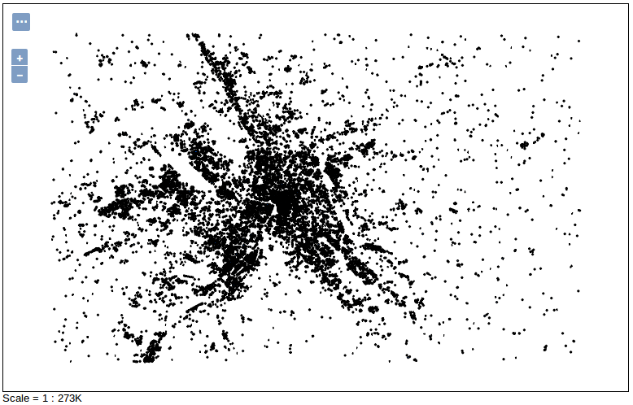
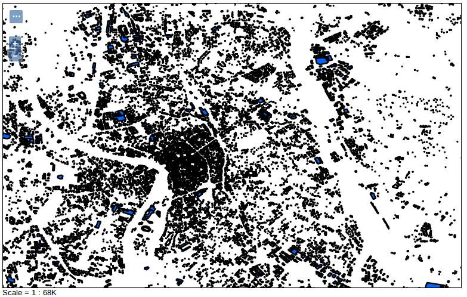
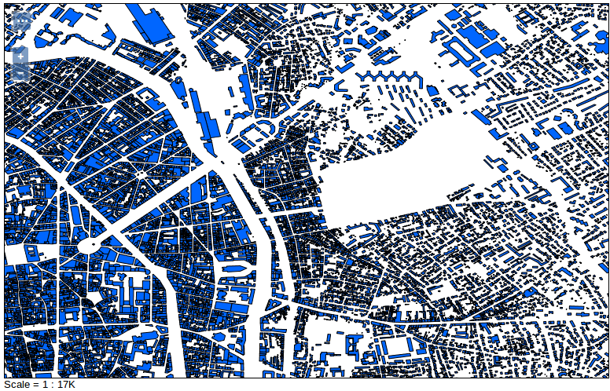
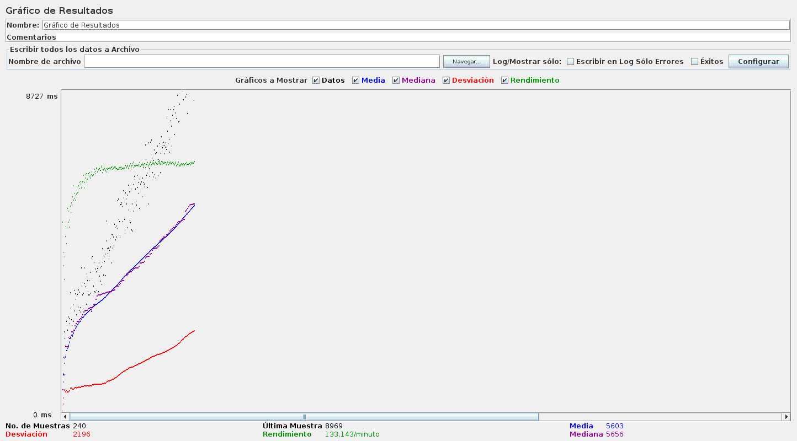

# PostGIS contraataca

En el punto anterior, hemos visto que servir datos con una simbología estándar es más eficiente con shapefiles que con PostGIS. Sin embargo PostGIS, al estar basado en PostgreSQL y ser éste un sistema de gestión de base de datos, nos va a permitir realizar determinados trucos de forma rápida que no son posibles en un formato de tipo fichero.

## La clave

Como se comentaba en el punto anterior, la conexión entre PostGIS y GeoServer es un cuello de botella. Tal vez se pueda optimizar y "ensanchar" este cuello pero en este webinar veremos cómo utilizar las capacidades de PostGIS y un estilado inteligente para reducir las necesidades de comunicación.

La regla fundamental es: Nunca hay que dibujar muchos objetos. Un mapa muestra un mensaje y es posible que a una escala grande (zoom cercano) tengamos que poner todos los detalles que queremos transmitir. Pero a una escala pequeña (extent completo) no necesitamos utilizar simbologías complejas... ni siquiera dibujar todos los objetos.

## Manos a la obra

Así pues, se repetirán los mismos ejemplos del punto anterior con PostGIS pero usando esta simbología:
  

	<?xml version="1.0" encoding="ISO-8859-1"?>
	<StyledLayerDescriptor version="1.0.0"
	                       xsi:schemaLocation="http://www.opengis.net/sld http://schemas.opengis.net/sld/1.0.0/StyledLayerDescriptor.xsd"
	                       xmlns="http://www.opengis.net/sld" xmlns:ogc="http://www.opengis.net/ogc"
	                       xmlns:xlink="http://www.w3.org/1999/xlink" xmlns:xsi="http://www.w3.org/2001/XMLSchema-instance">
	
	  <NamedLayer>
	    <Name>poligono_simplificado</Name>
	    <UserStyle>
	      <Title>A orange polygon style</Title>
	      <FeatureTypeStyle>
	        <Title>porescala</Title>
	        <Rule>
	          <ogc:Filter>
	            <ogc:PropertyIsGreaterThan>
	              <ogc:PropertyName>area</ogc:PropertyName>
	              <ogc:Literal>500</ogc:Literal>
	            </ogc:PropertyIsGreaterThan>
	          </ogc:Filter>
	          <MinScaleDenominator>100000</MinScaleDenominator>
	          <PolygonSymbolizer>
	            <Fill>
	              <CssParameter name="fill">#0066ff
	              </CssParameter>
	            </Fill>
	            <Stroke>
	              <CssParameter name="stroke">#000000</CssParameter>
	              <CssParameter name="stroke-width">2</CssParameter>
	            </Stroke>
	          </PolygonSymbolizer>
	        </Rule>
	        <Rule>
	          <ogc:Filter>
	            <ogc:PropertyIsGreaterThan>
	              <ogc:PropertyName>area</ogc:PropertyName>
	              <ogc:Literal>250</ogc:Literal>
	            </ogc:PropertyIsGreaterThan>
	          </ogc:Filter>
	          <MinScaleDenominator>25000</MinScaleDenominator>
	          <MaxScaleDenominator>100000</MaxScaleDenominator>
	          <PolygonSymbolizer>
	            <Fill>
	              <CssParameter name="fill">#0066ff
	              </CssParameter>
	            </Fill>
	            <Stroke>
	              <CssParameter name="stroke">#000000</CssParameter>
	              <CssParameter name="stroke-width">2</CssParameter>
	            </Stroke>
	          </PolygonSymbolizer>
	        </Rule>
	        <Rule>
	          <MaxScaleDenominator>25000</MaxScaleDenominator>
	          <PolygonSymbolizer>
	            <Fill>
	              <CssParameter name="fill">#0066ff
	              </CssParameter>
	            </Fill>
	            <Stroke>
	              <CssParameter name="stroke">#000000</CssParameter>
	              <CssParameter name="stroke-width">0.5</CssParameter>
	            </Stroke>
	          </PolygonSymbolizer>
	        </Rule>
	
	      </FeatureTypeStyle>
	    </UserStyle>
	  </NamedLayer>
	</StyledLayerDescriptor>

En dicho estilo estamos creando tres reglas que se aplican en distintos niveles de escala:

* escala menor que 1/100.000
* escala mayor que 1/100.000 y menor que 1/25.000
* escala menos que 1/25.000

Esto se especifica en el documento XML con tres elementos `Rule` y los `MinScaleDenominator` y `MaxScaleDenominator` que tienen dentro.

Para la escala menor de todas estamos filtrando por el campo area. Es decir, sólo vamos a dibujar los objetos que tengan un área mayor de 500. Para el siguiente bloque `Rule`, entre 1/100.000 y 1/25.000, dibujamos los objetos con un area mayor de 250, para incluir más objetos, ya que estamos más cerca. Por último, en el último nivel de escala, que recordemos PostGIS puede preparar muy rápido, se dibujan todos los objetos.

Ahora ¡solo nos falta tener un campo `area` con los valores del área! Cuidado porque los datos están en latitud/longitud y hay que transformar a un sistema de referencia plano, como Lambert93 (EPSG:2154).

	psql -U $USER -d $DB -c "alter table gis.toulouse add column area real"
	psql -U $USER -d $DB -c "update gis.toulouse set area=st_area(st_transform(geom, 2154))"
	psql -U $USER -d $DB -c "create index area_idx on gis.toulouse(area)"
	psql -U $USER -d $DB -c "vacuum analyze gis.toulouse"

Una vez creado el campo abrimos la capa en GeoServer, recargamos el "FeatureType" para que detecte el nuevo campo `area` y le asignamos el símbolo a nuestra capa.

Al ir al layer preview veremos que en el zoom completo ya no se dibujan todas las geometrías y que el renderizado es mucho más rápido. Y si nos acercamos por debajo de 1:100k veremos que aparecen algunas más y que por debajo de 1:25k vemos todo. Y que además va muy rápido.

## Behind the scenes

Si miramos el log de postgreSQL podemos ver cómo cuando estamos en un nivel de escala grande las instrucciones que recibe de GeoServer son estás:

	SELECT "gid",encode(ST_AsBinary(ST_Simplify(ST_Force2D("geom"), 1.71661376953125E-5, true)),'base64') as "geom" FROM "gis"."toulouse" WHERE  "geom" && ST_GeomFromText('POLYGON ((1.4523625373840332 43.60628128051758, 1.4523625373840332 43.616580963134766, 1.4689278602600098 43.616580963134766, 1.4689278602600098 43.60628128051758, 1.4523625373840332 43.60628128051758))', 4326)

Mientras que si nos alejamos aparecen nuevas condiciones en el `WHERE` para filtrar por área:

	SELECT "gid","area",encode(ST_AsBinary(ST_Simplify(ST_Force2D("geom"), 1.373291015625E-4, true)),'base64') as "geom" FROM "gis"."toulouse" WHERE  ("geom" && ST_GeomFromText('POLYGON ((1.396636962890625 43.5304069519043, 1.396636962890625 43.6128044128418, 1.5291595458984375 43.6128044128418, 1.5291595458984375 43.5304069519043, 1.396636962890625 43.5304069519043))', 4326) AND "area" > 0.0 AND "area" IS NOT NULL )

Es por esto que antes hemos creado el índice sobre el campo área.

## Resultados

Se aplica la misma prueba que se aplicó al shapefile: 240 peticiones en 1m40s. Aunque el comportamiento es similar, las magnitudes distan mucho.

 

