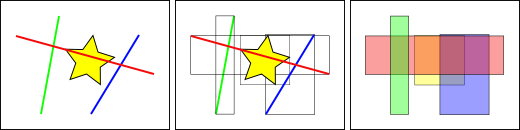

# Preparando datos vectoriales

## Configuraciones preliminares

A la hora de publicar datos vectoriales podemos hacer las elecciones significativas siguientes:

* Publicar en formato shapefile
* Meter los datos en una base de datos PostGIS


Partimos de datos de [OpenStreetMap de Toulouse](https://www.geofabrik.de/data/shapefiles_toulouse.zip), que ocupan unos 80Mb en Shapefile. Estos datos son cargados en PostGIS y se crean dos capas en GeoServer, una que accede al shapefile llamada `toulouse_shp` y otra que accede a la tabla en PostGIS llamada `toulouse_postgis`.

Para que el uso de PostGIS tenga sentido, es necesaria la creación de índices tanto en la clave primaria como en la columna geométrica. Los índices espaciales nos permitirán mejorar la eficiencia de las consultas mediante el uso del operador caja de PostGIS. Como se puede ver en la imagen a continuación, para que la consulta sea más efectiva, si buscamos los objetos que intersectan a la estrella amarilla, usando las cajas que encierran los elementos podremos descartar ciertos elementos de los que observamos que ni siquiera sus cajas se intersectan.



Por tanto, tras realizar la carga:

```bash
USER=portal_admin
DB=portal
psql -U $USER -d $DB -c "CREATE SCHEMA gis;"
shp2pgsql -s 4326 gis.osm_buildings_v06.shp gis.toulouse | psql -U $USER -d $DB
```
Podemos comprobar si existen los índices creados en la tabla mediante:

```sql
 portal=> \d gis.toulouse;
 gid        | integer                     | not null default nextval('gis.toulouse_gid_seq'::regclass)
 osm_id     | numeric(10,0)               |
 lastchange | character varying(20)       |
 code       | smallint                    |
 fclass     | character varying(8)        |
 type       | character varying(20)       |
 number     | character varying(10)       |
 geom       | geometry(MultiPolygon,4326) |
```
Para crear el índice, ejecutaremos los siguientes comandos:
```bash
psql -U $USER -d $DB -c "create index toulouse_geom_gix ON gis.toulouse using gist(geom)"
psql -U $USER -d $DB -c "vacuum analyze gis.toulouse"
```
Y ahora comprobaremos que el índice está creado:

```sql
portal=> \d gis.toulouse;
                                         Table "gis.toulouse"
   Column   |            Type             |                         Modifiers                          
------------+-----------------------------+------------------------------------------------------------
 gid        | integer                     | not null default nextval('gis.toulouse_gid_seq'::regclass)
 osm_id     | numeric(10,0)               |
 lastchange | character varying(20)       |
 code       | smallint                    |
 fclass     | character varying(8)        |
 type       | character varying(20)       |
 number     | character varying(10)       |
 geom       | geometry(MultiPolygon,4326) |
Indexes:
    "toulouse_pkey" PRIMARY KEY, btree (gid)
    "toulouse_geom_gix" gist (geom)
```

Para Shapefile también estamos utilizando un índice pero éste lo crea automáticamente GeoServer, si el usuario `Tomcat7`, que ejecuta GeoServer, tiene permisos para acceder al directorio. En caso de tener problemas de rendimiento con un Shapefile es conveniente revisar el log de GeoServer en busca de algo similar a esto:

```bash
	14 oct 05:11:52 ERROR [data.shapefile] - /var/geoserver/shapefiles/gis.osm_buildings_v06.qix (Permiso denegado)
	java.io.FileNotFoundException: /var/geoserver/shapefiles/gis.osm_buildings_v06.qix (Permiso denegado)
```
En un principio un shapefile dará mejor rendimiento que PostGIS ya que es una forma de acceder a los datos más directa. Para obtener un rendimiento mayor con PostGIS hay que trabajar un poco más y es muy conveniente obtener el feedback inmediato de lo que GeoServer pide a PostgreSQL. Para ello habilitaremos el log estableciendo esta opción en su fichero de configuración `/etc/postgresql/9.5/main/postgresql.conf`

```bash
log_statement = 'all'
```
A continuación reiniciaremos el servidor:

```bash
sudo service postgresql restart
```
y abriremos una sesión en el servidor y mostraremos constantemente el log:
```bash
tail -f /var/log/postgresql/postgresql-9.5-main.log
```
Para monitorizar también posibles problemas de memoria ejecutaremos el comando `htop` en otro terminal:


## Pruebas

Las siguientes pruebas realizarán una petición a la extensión máxima de la capa:


	http://192.168.0.27:8080/geoserver/geomatico/wms?SERVICE=WMS&VERSION=1.1.1&REQUEST=GetMap&FORMAT=image%2Fpng&TRANSPARENT=true&STYLES&LAYERS=geomatico%3Atoulouse_postgis&SRS=EPSG%3A4326&WIDTH=200&HEIGHT=200&BBOX=1.2668609619140625%2C43.40080261230469%2C1.6788482666015625%2C43.81278991699219
y a una parte pequeña de ella:


	http://192.168.0.27:8080/geoserver/geomatico/wms?SERVICE=WMS&VERSION=1.1.1&REQUEST=GetMap&FORMAT=image%2Fpng&TRANSPARENT=true&STYLES&LAYERS=geomatico%3Atoulouse_pg&SRS=EPSG%3A4326&WIDTH=200&HEIGHT=200&BBOX=1.461317092180252%2C43.62045407295227%2C1.4621217548847198%2C43.62125873565674

### Extensión completa

Las peticiones son extremadamente lentas, sobre todo en el caso de PostGIS. Para evitar colapsar el servicio se configura JMter para que encadene una petición detrás de otra, dándole tiempo al sistema a terminar.

Podemos observar que el shapefile es 10 veces más eficiente que la base de datos. El índice espacial que hemos creado no se puede aprovechar ya que se quiere leer el juego de datos completo y la transferencia de datos se hace de una forma más lenta.

Se puede jugar con el parámetro `fetch_size` del datastore para aumentar el número de registros que se recuperan en una conexión pero esto sólo tiene sentido cuando el servidor de mapas y de base de datos tienen una latencia importante entre ellos. En general la dirección que se debe de tomar es la opuesta: en lugar de aumentar el buffer de lectura con la base de datos se debe reducir la cantidad de elementos que se leen, como veremos en el apartado de estilos.

#### Shapefile

* *Nombre o Servidor o IP*: url del servidor, en nuestro caso **192.168.0.12**
* *Puerto*: 8080
* *Ruta*: */geoserver/unredd/wms?service=WMS&version=1.1.0&request=GetMap&layers=unredd:toulouse_shape&styles=&bbox=1.24776995182037,43.4666137695312,1.69823014736176,43.7463874816895&width=768&height=476&srs=EPSG:4326&format=image/png*


#### PostGIS

* *Nombre o Servidor o IP*: url del servidor, en nuestro caso **192.168.0.12**
* *Puerto*: 8080
* *Ruta*: */geoserver/unredd/wms?service=WMS&version=1.1.0&request=GetMap&layers=unredd:toulouse_postgis&styles=&bbox=1.24776995182037,43.4666137695312,1.69823014736176,43.7463874816895&width=768&height=476&srs=EPSG:4326&format=image/png*


#### Concurrencia en shapefile

Sin embargo el tiempo de respuesta, incluso con Shapefile es inaceptable para un servidor que vaya a tener un uso intensivo. La siguiente imagen muestra los resultados haciendo 240 peticiones en 1m40s.


### Extensión pequeña

Vemos ahora que el rendimiento es mucho mejor ya que en ambos formatos se filtra con la ayuda de los índices y se encuentran rápidamente los objetos que hay que pintar.

Se lanzan 240 peticiones en 30 segundos y no se produce ningún colapso en el servidor, ya que las peticiones se resuelven instantáneamente. PostGIS sigue funcionando más lento pero ya a un nivel casi inapreciable.

#### Shapefile

* *Nombre o Servidor o IP*: url del servidor, en nuestro caso **192.168.0.12**
* *Puerto*: 8080
* *Ruta*: /geoserver/unredd/wms?SERVICE=WMS&VERSION=1.1.1&REQUEST=GetMap&FORMAT=image%2Fpng&TRANSPARENT=true&STYLES&LAYERS=unredd%3Atoulouse_shape&SRS=EPSG%3A4326&WIDTH=768&HEIGHT=476&BBOX=1.4514613151550293%2C43.60658973455429%2C1.4535212516784668%2C43.60786646604538


#### PostGIS

* *Nombre o Servidor o IP*: url del servidor, en nuestro caso **192.168.0.12**
* *Puerto*: 8080
* *Ruta*: /geoserver/unredd/wms?SERVICE=WMS&VERSION=1.1.1&REQUEST=GetMap&FORMAT=image%2Fpng&TRANSPARENT=true&STYLES&LAYERS=unredd%3Atoulouse_postgis&SRS=EPSG%3A4326&WIDTH=768&HEIGHT=476&BBOX=1.4514613151550293%2C43.60658973455429%2C1.4535212516784668%2C43.60786646604538


### Extension aleatoria

Hasta ahora hemos realizado las pruebas con extensión total o con una extensión pequeña determinada. Esto no se corresponde exactamente con la realidad, mas hayá de que queramos comprobar la carga del inicio de nuestro portal, unico momento en el que controlamos la extensión, ya que en el momento que el usuario empiece a navegar por nuestros mapas, las extensiones serán definidas por él.

Para emular esto, JMeter dispone de una utilidad que nos permite cargar datos desde un [archivo CSV](_data/bboxs.csv). Como lo que variará en las peticiones será el BBOX de la misma, lo que haremos será extraer un número de BBOX's desde una [aplicación desarrollada para tal uso](http://michogarcia.org/bboxs2jmeter/) que nos generará un número determinado de BBOX's. Estos los guardaremos en un archivo CSV y configuraremos JMeter para poder extraer de este archivo los BBOX's.

#### Configurando JMeter para obtener extensiones aleatorias
A partir del plan de pruebas que tenemos definido, lo que haremos será añadir una *Configuración del CSV Dataset* a partir de botón derecho sobre la *Petición HTTP*, *Añadir*, *Elemento de Configuración* y *Configuración del CSV Dataset*.


Los datos que deberemos incluir serán:

* Nombre del Archivo: con la ruta completa al archivo
* Nombres de variables: bbox
* Delimitador: por ejemplo **;** ya que en este caso solo habrá una variable en el CSV

Ahora deberemos configurar la *Peticion HTTP* para que utilice el BBOX desde el CSV. Para ello,


en la pestaña de **Parameters**, añadiremos un registro pulsando sobre *Añadir* e introduciendo:

* Nombre: **bbox** (el nombre que usará en la URL)
* Valor: ${bbox} (el nombre que le hemos dado en la Configuración Anterior)
* Codificar: true

Ahora deberemos elimiar el bbox de la ruta, y si realizamos las peticiones, comprobaremos que esta tomando el valor del BBOX del CSV, y que está realizando peticiones con diferentes extensiones:


o por ejemplo,


Utilizando este método, tendremos para:

#### PostGIS

* *Nombre o Servidor o IP*: url del servidor, en nuestro caso **192.168.0.12**
* *Puerto*: 8080
* *Ruta*: /geoserver/unredd/wms?SERVICE=WMS&VERSION=1.1.1&REQUEST=GetMap&FORMAT=image%2Fpng&TRANSPARENT=true&STYLES&LAYERS=unredd%3Atoulouse_postgis&SRS=EPSG%3A4326&WIDTH=768&HEIGHT=476


#### Shapefile

* *Nombre o Servidor o IP*: url del servidor, en nuestro caso **192.168.0.12**
* *Puerto*: 8080
* *Ruta*: /geoserver/unredd/wms?SERVICE=WMS&VERSION=1.1.1&REQUEST=GetMap&FORMAT=image%2Fpng&TRANSPARENT=true&STYLES&LAYERS=unredd%3Atoulouse_shape&SRS=EPSG%3A4326&WIDTH=768&HEIGHT=476

